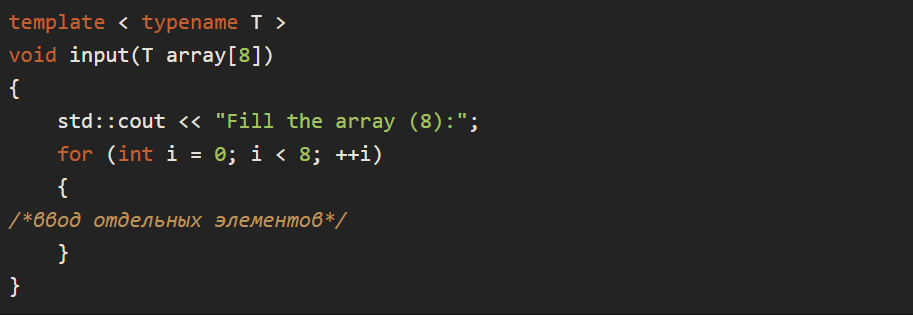

# 33.5 Практическая работа

### Цели практической работы

Освоить ряд продвинутых возможностей C++. Научиться:

1. генерировать стандартные исключения,
2. создавать собственные типы исключений,
3. создавать шаблонные функции и классы.

### Что входит в работу

1. Реализовать работу корзины с покупками.
2. Реализовать игру по ловле рыбы.
3. Реализовать реестр данных на шаблонах.
4. Найти среднее арифметическое число в массиве.

### Общие условия

Разработка выполняется в среде CLion.

## Задание 1. Работа корзины с покупками

### Что нужно сделать

Реализуйте простую и безопасную модель работы корзины онлайн-магазина.

В начале программы вы заполняете базу данных самого магазина через стандартную консоль. Каждый элемент этой базы данных состоит из двух компонентов — артикула и количества штук.
Корзина должна поддерживать следующие операции: добавление товара с указанным его количеством — add, удаление товара с указанным количеством — remove. Обе операции принимают артикул товара в виде строки и количество в виде целого числа.
При вводе аргументов к операциям должна осуществляться их валидация. Артикул должен быть в базе данных магазина, количество не должно превышать количество доступного продукта на складе (при удалении — в корзине).

### Рекомендации

В качестве контейнера для базы данных и самой корзины можете использовать std::map.

Если пользователь ввёл некорректную информацию, то лучше выбросить std::invalid_argument, в других случаях — runtime_error.

### Что оценивается

Корректность логики работы при использовании исключений.

## Задание 2. Игра по ловле рыбы

### Что нужно сделать

Реализуйте простую игру-симуляцию ловли рыбы. Игровое поле представляет собой девять секторов условного пруда. В начале игры в одном из этих секторов с помощью генератора случайных чисел оказывается рыба. Точно так же, случайным образом, по секторам пруда распределяются и три сапога. Сапог и рыба при этом не могут находиться в одном и том же секторе одновременно, как и несколько сапог сразу в одном из секторов.

Игрок закидывает удочку с приманкой в один из секторов, номер которого вводится стандартным способом через консоль. Задача игрока — угадать сектор, в котором находится рыба и, таким образом, поймать её. Если игрок попал на пустой сектор, то удочку надо забросить повторно. Если игрок поймал сапог, то игра завершается с отрицательным результатом.

Реализовать задачу нужно с помощью исключений: когда успешный заброс удочки генерирует специальное пользовательское исключение, после чего программа должна завершиться и оповестить пользователя об успешной рыбалке и количестве попыток, которое ему для этого потребовалось. Если же был пойман сапог, то должно выводиться сообщение о неудачной ловле.

### Рекомендации

Вспомните, что вы можете выбросить в качестве исключения произвольный тип данных. Это может быть и сапог, и рыба.

В функции main потребуется расположить рыбу случайным образом. Для этого сделайте std::srand(std::time(nullptr)); а затем само расположение: field[std::rand() % 9].fish = new Fish(); Благодаря оператору % вы не выйдете за пределы массива.

### Что оценивается

Корректность работы игровой логики. Точность использования исключений.

## Задание 3. Реестр данных на шаблонах

### Что нужно сделать

С помощью шаблонов реализуйте простой класс реестра, хранящий произвольные типы значений по ключам произвольного типа. Ключи при этом могут повторяться.

Реестр должен поддерживать следующие операции: добавление элемента с ключом, удаление элементов с заданным ключом, вывод всех значений с ключами в консоль, поиск элементов по ключу.

Для тестирования программы предусмотрите ввод данных и команд из стандартной консоли:

1. add — добавить элемент с ключом;
2. remove — удалить все элементы с заданным ключом;
3. print — напечатать на экране все элементы с их ключами;
4. find — найти все элементы по их ключу.

Данный словарь должен работать на значениях и ключах следующих типов: int, double, std::string.

### Рекомендации

Для реализации можете использовать стандартный шаблон std::vector, который в свою очередь уже будет хранить ваши пары ключей и значений.
Сама пара ключа и значения как раз и будет классом (или струкурой), шаблонизированным двумя типами: типом значения и типом ключа.
При желании вы можете создать отдельную шаблонизированную функцию с вводом команд и их данных.

### Что оценивается

Корректность работы логики программы, реализованной с помощью шаблонов.

## Задание 4. Среднее арифметическое число в массиве

### Что нужно сделать

Реализуйте шаблонную функцию подсчёта среднего арифметического числа в массиве скалярных чисел произвольного типа. Это может быть int, double, float и так далее.

Ввод данных массива и вывод результата производится через стандартную консоль.

### Рекомендации

Для простоты можете реализовать подсчёт в массиве фиксированной длины.

Функцию ввода данных массива тоже рекомендуется реализовать как шаблонную.

Обе функции имеют похожую сигнатуру вида: 

### Что оценивается

Корректность работы программы при различных пользовательских данных и различных типах используемых данных массива.

